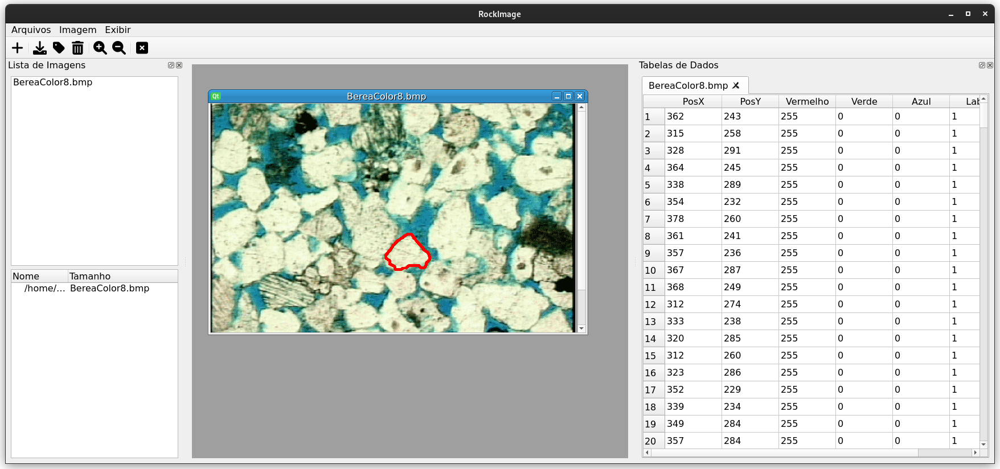

# Rock Image C++

Rock Image C++ is simple GUI application build in C++ and Qt to label images from rocks for neural networks training.

## About 📕

## Technologies 💻

## Getting Started 🚀

## Testing 🧪

