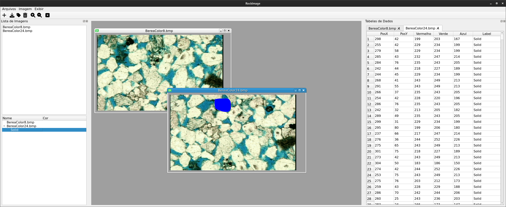

# Rock Image Annotation Tool

Rock Image C++ is simple GUI application build in C++ and Qt to label layers from rocks for neural networks training.

## About 📕

## Technologies 💻

## Getting Started 🚀

## Testing 🧪

